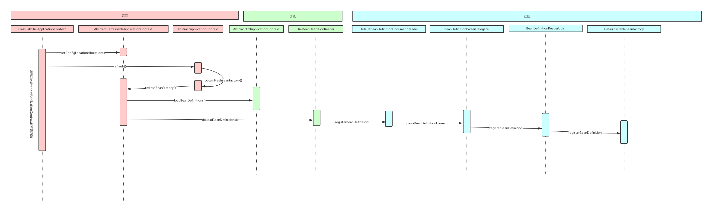

# 第8章 一步一步手绘Spring IoC运行时序图

## 1 Spring核心容器类图

- BeanFactory：定义了IoC容器的基本功能规范，只对IoC容器的基本行为做了定义
- ApplicationContext：提供IoC容器的基本功能，支持信息源，实现国际化；访问资源；支持应用事件
- BeanDefinition：Bean对象在Spring实现中的描述
- BeanDefinitionReader：对Spring配置文件的解析

## 2 基于XML的IoC容器初始化

- IoC容器的初始化包括BeanDefinition的Resource定位、加载和注册三个基本的过程
- ApplicationContext允许上下文嵌套，通过保持父上下文可以维持一个上下文体系
- 获得配置路径步骤：
    1. 调用父容器的构造方法super(parent)为容器设置好Bean资源加载器
    2. 调用父类 AbstractRefreshableConfigApplicationContext的setC nfigLocations(configLocations) 方法设置Bean配置信息的定位路径
- 开机启动（refresh方法）：
    1. 调用容器准备刷新的方法，获取容器的当前时间，同时给容器设置同步标识
    2. 告诉子类启动 refreshBeanFactory()方法，Bean定义资源文件的载入从子类的refreshBeanFactory()方法启动
    3. 为 BeanFactory配置容器特性，例如类加载器、事件处理器等
    4. 为容器的某些子类指定特殊的Post事件处理器
    5. 调用所有注册的BeanFactoryPostProcessor的Bean
    6. 为BeanFactory注册Post事件处理器
    7. 初始化信息源，和国际化相关
    8. 初始化容器事件传播器
    9. 调用子类的某些特殊Bean的初始化方法
    10. 为事件传播器注册事件监听器
    11. 初始化所有剩余的单例Bean
    12. 初始化容器的生命周期事件处理器，并发布容器的生命周期事件
    13. 销毁已创建的Bean
    14. 取消刷新操作，重置容器的同步标识
    15. 重设公共缓存
- `refresh()`方法主要作用：在创建IoC容器前，如果已经有容器存在，需要把已有的容器销毁和关闭，以保证在refresh()方法之后使用的是新创建的IoC容器
- Spring配置文件中`<bean>`元素中`<property>`子元素的相关配置处理：
1. ref 被封装为指向依赖对象的一个引用
2. value 被封装成一个字符串类型的对象
3. ref 和 value都通过“解析的数据类型属性值.setSource(extractSource(ele));”方法将属性值（或引用）与所引用的属性关联起来

## 3 基于注解的IoC初始化

- 管理注解的Bean定义容器：AnnotationConfigApplicationContext 和 AnnotationConfigWebApplicationContext
- Spring对注解处理的两种方式：
    1. 直接将注解 Bean 注册到容器中：可以在初始化容器时注册，也可以在容器创建之后手动调用注册方法向容器注册，然后通过手动刷新容器，使容器对注册的注解 Bean 进行处理
    2. 通过扫描指定的包及其子包下的所有类处理：在初始化注解容器时，指定要自动扫描的路径，如果容器创建以后向给定路径动态添加了注解 Bean ，则需要手动调用容器扫描的方法手动刷新容器，使容器对所注册的注解 Bean 进行处理
- 注册注解Bean定义类的基本步骤：
    1. 使用注解元数据解析器，解析注解 Bean 中关于作用域的配置
    2. 使用 AnnotationConfigUtils 的 processCommonDefinitionAnnotations() 方法处理注解 Bean 定义类中通用的注解
    3. 使用 AnnotationConfigUtils 的 applyScopedProxyMode() 方法创建作用域的代理对象
    4. 通过 BeanDefinitionReaderUtils 向容器注册 Bean
 
## 4 IoC容器初始化基本步骤
1. 通过 ResourceLoader 来完成资源文件的定位，DefauItResourceLoader 是默认的实现，同时上下文本身就给出了 ResourceLoader 实现，可以通过类路径、文件系统、URL等方式来定位资源
2. 如果是 XmlBeanFactory 作为 IoC 容器，那么需要为它指定 Bean 定义的资源，也就是说 Bean 定义文件时，通过抽象成 Resource 来被 IoC 容器处理，容器通过 BeanDefinitionReader 来完成定义信息的解析和 Bean 信息的注册，往往使用 XmlBeanDefinitionReader 来解析 Bean
XML 定义文件（实际的处理过程是委托给 BeanDefinitionParserDelegate 来完成的，从而得到
Bean 定义信息，这些信息在 Spring 中使用 BeanDefinition 来表示），主要用于处理 BeanDefinition
3. 容器解析得到 BeanDefinition 后，需要在 IoC 容器中注册，这由 IoC 实现 BeanDefinitionRe istry接口来实现，注册过程就是在 IoC 容器内部维护的 HashMap 来保存得到的 BeanDefinition 过程，这个 HashMap 是 IoC 容器持有 Bean 信息的场所，以后对 Bean 操作都是围绕这个 HashMap
来实现的。

## 5 IoC运行时序图

