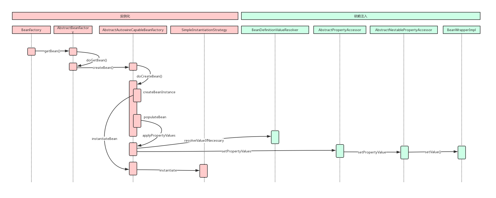

# 第9章 一步一步手绘Spring DI运行时序图

## 1 Spring 自动装配之依赖注入

- 依赖注入的两种情况：
    1. 用户第一次调用`getBean()`方法时，IoC容器触发依赖注入
    2. 当用户在配置文件中将`<bean>`元素配置了`lazy-init=false`属性时，即让容器在解析注册`Bean`定义时进行预实例化，触发依赖注入
- BeanFactory是管理Bean的工厂，FactoryBean是创建对象的工厂Bean
- 获取Bean的入口：
    1. 如果Bean定义为单例模式的，则容器在创建之前，先从缓存中查找，以确保整个容器中只存在一个实例对象
    2. 如果Bean定义为原型模式的，则容器每次都会创建一个新的实例对象
    3. Bean定义还指定其生命周期范围
- Bean依赖注入步骤：
    1. 调用`createBeanInstance()`方法生成Bean所包含的Java对象实例
    2. 调用`populateBean()`方法对Bean属性的依赖注入进行处理
- CGLib是一个常用的字节码生成器的类库，JDK动态代理只能针对接口，如果一个类没有实现任何接口，要对其进行动态代理，只能使用CGLib
- 属性注入过程：
    1. 属性值类型不需要强制转换时，不需要解析属性值，直接进行依赖注入
    2. 属性值类型需要强制转换时，如对其他对象的引用等，首先需要解析属性值，然后对解析后的属性值进行依赖注入
- Spring IoC容器将属性值注入Bean实例对象的过程
    1. 对于集合类型的属性，将属性值解析为目标类型的集合后，直接赋值给属性
    2. 对于非集合类型饿属性，大量使用JDK的反射机制，通过属性的`getter()`方法，获取指定属性注入前的值，同时调用属性的`setter()`方法为属性设置注入后的值

## 2 Spring IoC容器中那些鲜为人知的细节

- 延时加载：如果设置了`lazy-init`，容器在完成Bean定义的注册后，会通过`getBean()`方法触发指定Bean的初始化和依赖注入。当应用程序第一次向容器索取所需的Bean时，容器不再需要对Bean进行初始化和依赖注入，可直接从已经完成实例化和依赖注入的Bean中取一个现成的Bean，提高第一次获取Bean的性能
- BeanFactory：Bean工厂（是一个工厂），作用是管理Bean，即实例化、定位、配置应用程序中的对象及建立这些对象之间的依赖
- FactoryBean：工厂Bean（是一个Bean），作用是产生其他Bean实例，提供一个工厂方法，用于返回其他Bean实例
- IoC容器管理Bean依赖关系的方式：
    1. 显示管理：通过BeanDefinition的属性值和构造方法实现Bean依赖关系管理
    2. autowiring：IoC容器具有依赖自动装配功能，不需要对Bean属性的依赖关系做显式声明，只需要配置好autowiring属性，会自动使用反射查找属性的类型和名称，然后自动匹配容器中的Bean，自动完成依赖注入
- autowiring实现过程：
    1. 对Bean的属性调用`getBean()`方法，完成依赖Bean的初始化和依赖注入
    2. 将依赖Bean的属性引用设置到被依赖Bean的属性上
    3. 将依赖Bean的名称和被依赖Bean的名称存储在IoC容器的集合中

## 3 Spring DI运行时序图

