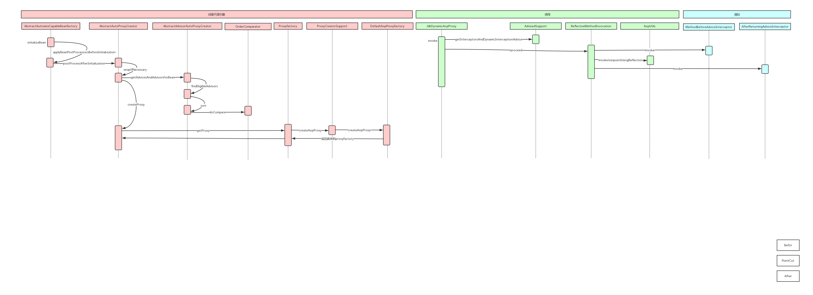

# 第10章 一步一步手绘Spring AOP运行时序图

## 1 Spring AOP简介

- Spring AOP概念：面向切面编程，可以通过预编译和运行时动态代理，实现在不修改源代码的情况下给程序动态统一添加功能；是一种编程范式，主要目的是将非功能性需求从功能性需求中分离出来，达到解耦的目的。
- 切面（Aspect）：一个关注点的模块化，这个关注点可能会横切多个对象
- 连接点（JoinPoint）：程序执行过程中的某一行为
- 通知（Advice）：切面对于某个连接点所产生的动作，类型包括前置通知、后置通知、返回后通知、环绕通知、异常通知
- 切入点（Pointcut）：匹配连接点的断言
- 目标对象（Target Object）：被一个或多个切面所通知的对象
- AOP代理（AOP Proxy）：JDK动态代理、CGLib代理

## 2 Spring AOP两种方法

- 注解方式：
1. 在XML文件中激活自动扫描组件功能，同时激活自动代理功能
2. 为切面类添加注解
- XML配置方式

## 3 Spring AOP运行时序图
