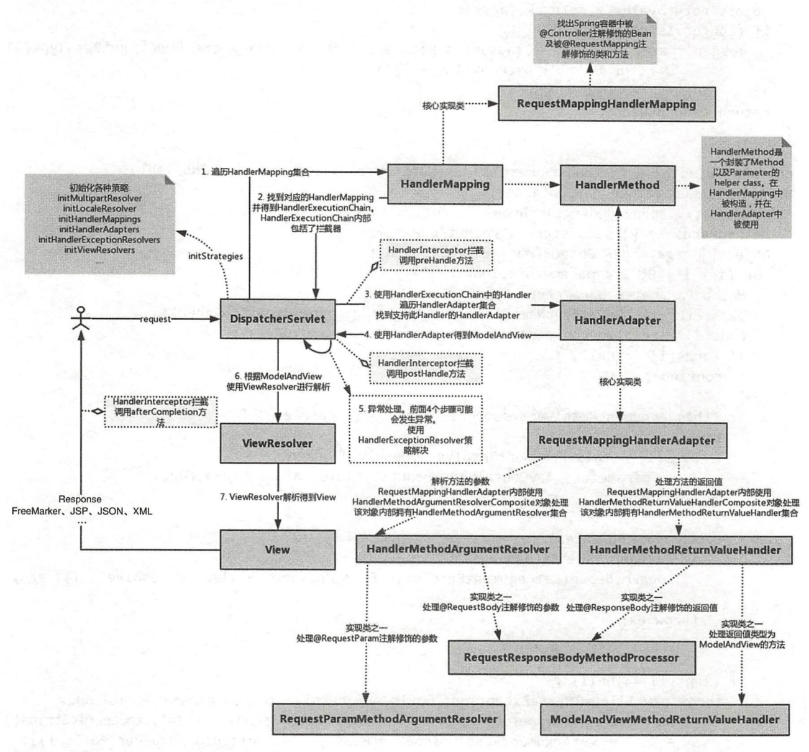
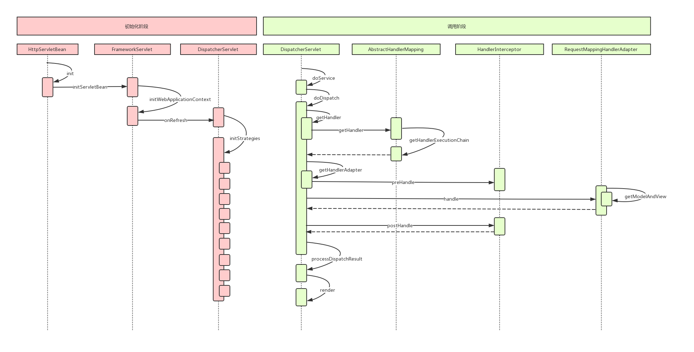

# 第11章 一步一步手绘Spring MVC运行时序图

## 1 Spring MVC 请求处理流程

1. 容器初始化时，会建立所有URL和Controller中方法的对应关系，并保存到Handler Mapping中，用户请求时，根据请求的URL快速定位到Controller中的某个方法
2. 在Spring中，先将URL和Controller的对应关系保存到Map<url, Controller>中
3. Web容器启动时，通知Spring初始化容器（加载Bean的定义信息、初始化所有单例Bean）
4. Spring MVC遍历容器中的Bean，获取每一个Controller中的所有方法访问的URL
5. 根据请求的URL，确认Controller中的方法，拼接Controller的URL和方法的URL，与请求的URL进行匹配，找到匹配的方法
6. 将请求中的参数绑定到方法的形式参数上，执行方法

## 2 Spring MVC九大组件

- HandlerMapping：用于查找Handler，当请求到达后，找到请求相应的处理器Handler和Interceptor
- HandlerAdapter：适配器
- HandlerExceptionResolver：用于处理Handler产生的异常情况，根据异常设置ModelAndView，交给渲染方法进行渲染，将其渲染成页面
- ViewResolver：视图解析器，将Spring类型的视图名和Locale解析为View类型的视图，只有一个`resloveViewName()`方法
- RequestToViewNameTranslator：从请求中获取ViewName
- LocaleResolver：从请求中解析出Locale
- ThemeReslover：解析主题，包括样式、图片及它们所形成的显示效果的集合
- MultipartReslover：处理上传请求，通过将普通的请求封装成MultipartHttpServletRequest来实现
- FlashMapManager：FlashMap用于重定向的参数传递，管理FlashMap

## 3 Spring MVC处理过程

1. ApplicationContext初始化时，用Map保存所有URL和Controller类的对应关系
2. 根据请求URL找到对应的Controller，并从Controller中找到处理请求的方法
3. 将Request参数绑定到方法的形参上，执行方法处理请求，并返回结果视图

## 4 Spring MVC优化建议

1. Controller如果能保持单例模式，尽量使用单例模式
2. 处理请求的方法中的形参务必加上@RequestParam注解
3. 缓存URL

## 5 Spring MVC组件关系图

## 6 Spring MVC运行时序图

